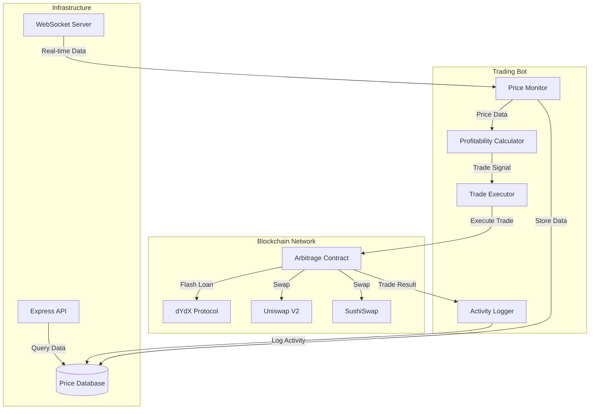

# DeFi Arbitrage Protocol

A sophisticated automated arbitrage trading system leveraging flash loans to execute risk-free trades between Uniswap and Sushiswap decentralized exchanges.

## 🏗 System Architecture



## 🚀 Key Features

- **Flash Loan Integration**: Utilizes dYdX flash loans for zero-capital arbitrage execution
- **Real-time Price Monitoring**: Continuously monitors price discrepancies across DEXes
- **Smart Contract Architecture**: Battle-tested Solidity contracts with comprehensive security measures
- **Automated Execution**: Fully automated trading bot with profitability calculations
- **Gas Optimization**: Implements efficient trading routes with gas cost considerations
- **Risk Management**: Built-in slippage protection and concurrent execution prevention

## 🏗 Technical Architecture

### Smart Contracts
- `Arbitrage.sol`: Core arbitrage logic and flash loan integration
- Implements secure token handling and DEX interactions
- Built on battle-tested OpenZeppelin contracts

### Trading Bot
- Real-time price monitoring system
- Advanced profitability calculations including gas costs
- Automated trade execution with safety checks
- Comprehensive logging and monitoring

### Infrastructure
- Hardhat development environment
- Mainnet forking for testing

## 💻 Technology Stack

- **Blockchain**: Ethereum
- **Smart Contracts**: Solidity ^0.8.9
- **Development Environment**: Hardhat
- **Backend**: Node.js, Alchemy
- **Libraries**: ethers.js, OpenZeppelin
- **DEX Integration**: Uniswap V2, Sushiswap
- **Flash Loan Provider**: dYdX

## 📊 Performance Metrics

- Average execution time: 1-3 blocks
- Gas optimization: Implements efficient routing and batching
- Arbitrage identification: Real-time price monitoring across DEXes
- Configurable minimum price difference threshold

## 🛠 Installation & Setup

1. Clone the repository
```bash
git clone https://github.com/SquilliamX/Trading-Bot.git
```

2. Install dependencies
```bash
npm install
```

3. Configure environment variables in a `.env` file

    - Add your configuration values

4. Deploy Contracts
```bash
npx hardhat run scripts/deploy.js --network ${NETWORK_ARGS}
```

5. Start the Trading Bot
```bash
node bot.js
```

## 🔒 Security Features

- Owner-only access controls
- Flash loan callback verification
- Slippage protection
- Balance verification
- Concurrent execution prevention
- Emergency stop functionality

## 📈 Business Applications

- **Institutional Trading**: Ready for institutional-grade trading operations
- **Liquidity Provision**: Helps maintain price equilibrium across DEXes
- **Market Making**: Can be adapted for market making strategies
- **Portfolio Management**: Integrable with portfolio management systems

## 🔧 Configuration

### Environment Modes

The system supports multiple operational modes through the `config.json` settings:

```json
{
  "PROJECT_SETTINGS": {
    "isLocal": true,    // Local blockchain or mainnet
    "isDeployed": true  // Execute trades or simulate only
  }
}
```

#### Mode Combinations

| isLocal | isDeployed | Description                             |
|---------|------------|-----------------------------------------|
| true    | true       | Local testing with trade execution      |
| true    | false      | Local testing with simulation only      |
| false   | true       | Mainnet monitoring with trade execution |
| false   | false      | Mainnet monitoring with simulation only |

### Testing Strategies

#### Local Development
```bash
# Set in config.json
{
  "PROJECT_SETTINGS": {
    "isLocal": true,
    "isDeployed": true
  }
}
```
Perfect for development and testing arbitrage strategies without risking real assets.

#### Mainnet Price Monitoring
```bash
# Set in config.json
{
  "PROJECT_SETTINGS": {
    "isLocal": false,
    "isDeployed": false
  }
}
```
Monitor real-time arbitrage opportunities without executing trades. Ideal for:
- Strategy validation
- Market analysis
- Performance testing
- Risk assessment

#### Production Deployment
```bash
# Set in config.json
{
  "PROJECT_SETTINGS": {
    "isLocal": false,
    "isDeployed": true
  }
}
```
Full production mode with real trade execution. Requires:
- Deployed smart contracts
- Funded accounts
- Proper security measures
- Network connectivity

## 🤖 Bot Architecture

### Core Components

The trading bot implements a sophisticated event-driven architecture with five primary components:

#### 1. Main Event Monitor (`main()`)
- Establishes WebSocket connections to DEXes
- Monitors real-time swap events
- Manages concurrent execution states
- Initializes system components

#### 2. Price Analysis Engine (`checkPrice()`)
- Real-time price discovery across DEXes
- Calculates cross-exchange price differentials
- Implements price normalization
- Logs market conditions for analysis

#### 3. Strategy Director (`determineDirection()`)
- Determines optimal trading routes
- Analyzes market depth
- Returns executable trading paths
- Validates exchange liquidity

#### 4. Profitability Engine (`determineProfitability()`)
- Advanced profit calculation algorithms
- Gas cost optimization
- Slippage prediction
- Risk assessment metrics

#### 5. Execution Manager (`executeTrade()`)
- Smart contract interaction
- Transaction management
- Flash loan coordination
- Post-trade verification

### System Customization

#### Trading Parameters
```javascript
// Configuration constants
const UNLOCKED_ACCOUNT = '0xdEAD...'  // Test account
const AMOUNT = '40500000000000'       // Trade size
```

#### Strategy Modification
The profitability engine can be customized by modifying `determineProfitability()`:
```javascript
function determineProfitability(routerPath, token0Contract, token0, token1) {
    // Implement custom trading strategy
    // Return true if profitable opportunity exists
}
```

#### Testing Framework
- `manipulate.js`: Price impact simulation
- `bot.js`: Strategy testing
- Configurable test parameters
- Detailed execution logs

## 📄 License

This project is licensed under the MIT License

## 🤝 Contributing

Contributions are welcome! Please feel free to submit a Pull Request. For major changes, please open an issue first to discuss what you would like to change.

Please make sure to update tests as appropriate.

## ⚠️ Disclaimer

This software is for educational purposes only. Trading cryptocurrency carries significant risk. Always perform your own due diligence before trading. Update this demo system to your compliment your strategy.

Note: This protocol is a demonstration of advanced Solidity development practices and my personal bots are private.

Built with ❤️ by Squilliam